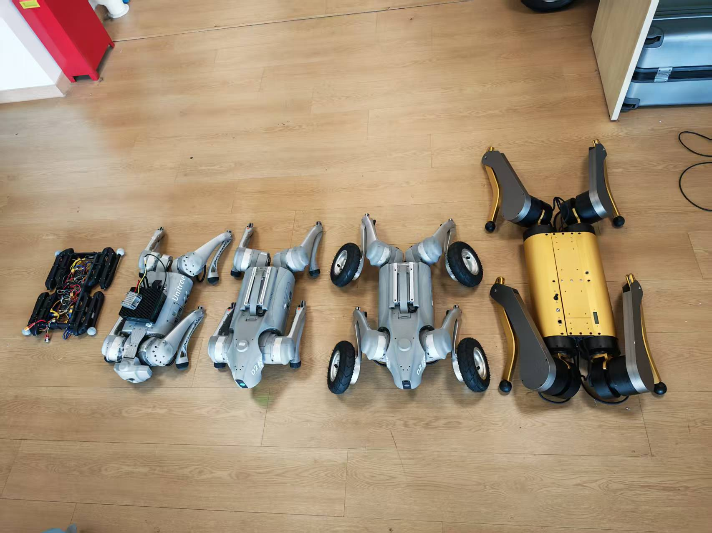

Robotics-Z Lab is part of the college of Intelligent Robotics and Advanced Manufacturing, Fudan University.  
Our research covers reinforcement learning for legged locomotion, leg–arm coordination control, and perception and navigation for autonomous robots. With a fully equipped test field, a variety of robotic platforms, and strong computational capabilities, we are committed to developing robust, adaptive, and intelligent robotic systems.  
We welcome collaborations and encourage motivated students and researchers to join our team.

  <figure class="col-span-2">
    
    <figcaption class="text-sm text-gray-500 mt-1 text-center">Experimental Site (Partial)</figcaption>
  </figure>

  <figure class="col-span-2">
    
    <figcaption class="text-sm text-gray-500 mt-1 text-center">Legged Robots (Partial)</figcaption>
  </figure>

  <figure class="col-span-2">
    
    <figcaption class="text-sm text-gray-500 mt-1 text-center">Robot Parkour</figcaption>
  </figure>

<!--more-->
